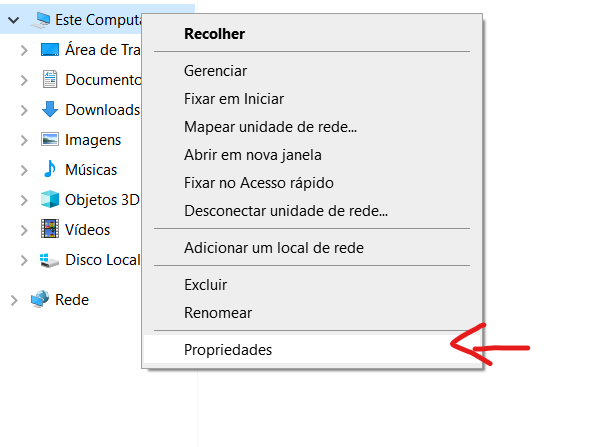
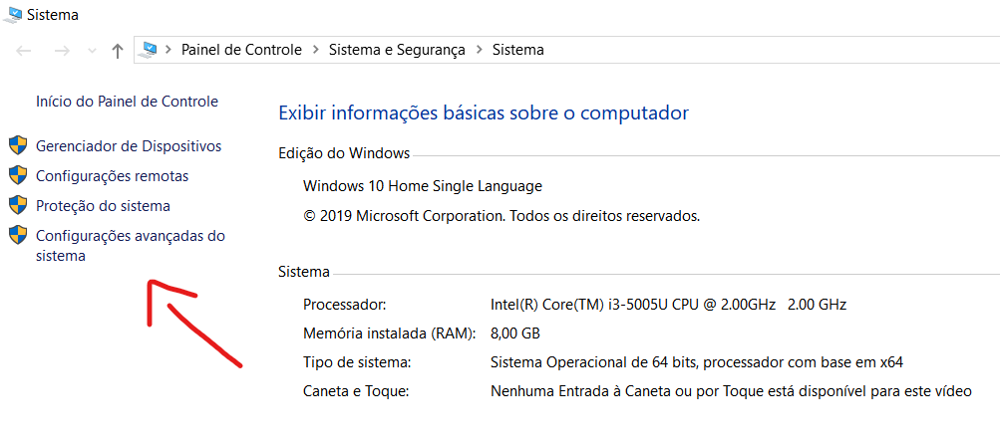
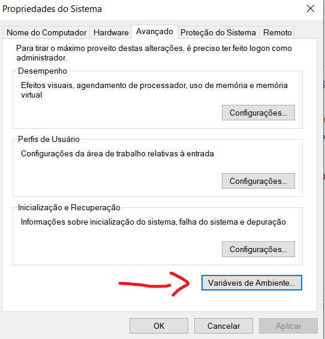
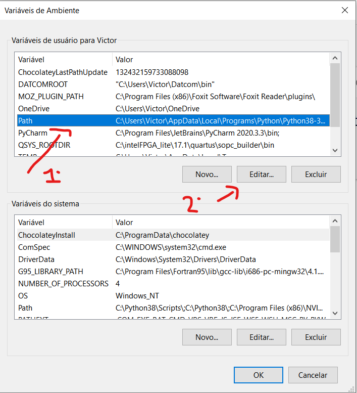
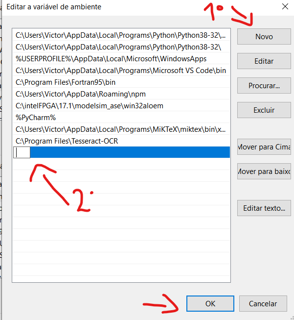
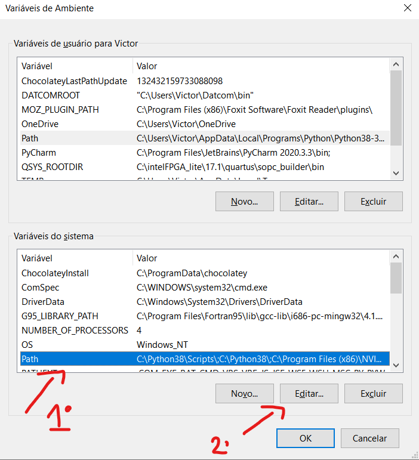

# PyAeroCounter
Contador de palavras para a Competição AeroDesign // Word counter for the Aerodesign Competition

Author:  Member of [Comissao Tecnica Aerodesign](www.aeroct.com.br)

            Geovana Neves (geovanan90@gmail.com)

## 1) WINDOWS: standalone application 

Get the standalone application in the folder 'dist'

```bash
./dist/PyAeroCounter.exe
```
or download [here](https://raw.githubusercontent.com/comissao-aerodesign/PyAeroCounter/master/dist/PyAeroCounter.exe) the .exe file

If you have any problem downloading the executable file, download the .zip that contains the PyAeroCounter.exe

```bash
./dist/PyAeroCounter.zip
```

or download [here](https://raw.githubusercontent.com/comissao-aerodesign/PyAeroCounter/master/dist/PyAeroCounter.zip) the .zip file

This standalone application  requires MikTeK and Tesseract OCR in order to execute properly, see item 3 of this file.

When the download is complete, it is recommended to create a folder and move the downloaded file to it.

## 2) PyAeroCounter.exe default inputs and outputs

It is necessary to place the .pdf file you want to count in the folder created earlier, together with the PyAeroCounter.exe file

PyAeroCounter.exe default input is to read a PDF document named 'pdffile.pdf'.

The default outputs include a log file containing the final result as well as text files with the extract text.

PyAeroCounter.exe also extract images from the PDF document and save them into 'PDFFILE' folder. 

To start counting, just run the PyAeroCounter.exe file and wait for it to finish counting. When the console closes, the count is finished and the logfile.txt file can be opened to check the count values.


 For different options, use the command line:

Example 1:
```bash
PyAeroCounter.exe -i EXAMPLE.pdf -d EXAMPLE_IMAGES
```

```bash
Available options:
-o : logfile filename           (string)
-w : wordsfile filename         (string)
-n : nonwordsfile filename      (string)
-d : images_folder name         (string)
-i : pdffile filename           (string)
-e : extract images             (boolean, integer: 0 or 1)
-f : strings_figures filename   (string)
-g : mathmodewords filename     (string)
```

## 3)  Dependencies - MikTeX

In order to properly handle images and its content, the user must have the following softwares installed:

### Extract images from PDF using pdftohtml - MikTeX Download:

https://miktex.org/download

### Google's Tesseract-OCR Engine

Download [here](https://digi.bib.uni-mannheim.de/tesseract/tesseract-ocr-w64-setup-v5.0.0.20190623.exe)

Tesseract repo: https://github.com/tesseract-ocr/tesseract   

In order for Tesseract to function correctly, it is necessary to create the Tesseract PATH environment variable.

1) Right click on "This computer", another menu will open, click on the last option, named "Properties"


2) Then, in the left-hand menu, click on the last option, whose name is 'Advanced system settings'


3) Click on the 'Environment Variables' option


4) Look for the 'Path' variable, click on it and then click on edit, as shown in the image.


5) Click on 'New' to create a new variable, and paste the directory in which Tesseract is installed, it is usually installed in C: \ Program Files \ Tesseract-OCR, in the location indicated with a 2 in the image. After doing this, click on 'OK'.


6) Similar to step x, now in the system variables, click on 'Path' and then click on 'new'.


7) Repeat the step 5.

8) After finishing, press 'Ok' on all screens to close and save the process.


If the user does not install the above software, PyAeroCounter.exe will not extract image and read the text from it.

## 4) For advanced users ... 
### ... that want to run the source code, it is necessary to install python and the following packages:

pdfminer3

pytesseract   (It requires the installation of the Google's Tesseract-OCR Engine)

------ Check the source code for more information.


WARNING: 
The pdfminer3 package was modified during the development of the PyAeroCounter script.

Substitute the following installed scripts in your computer for the ones provided in 'auxiliar' folder:

```bash
   cmapdb.py
   converter.py
```
   
   
   
### ... that want to compile the source code, use pyinstaller.

Get it: https://pypi.org/project/pyinstaller/

```bash
pyinstaller --onefile --nowindowed PyAeroCounter.py
```

## 5) Contact 

If you have any problem or suggestion, please send it to www.aeroct.com.br
